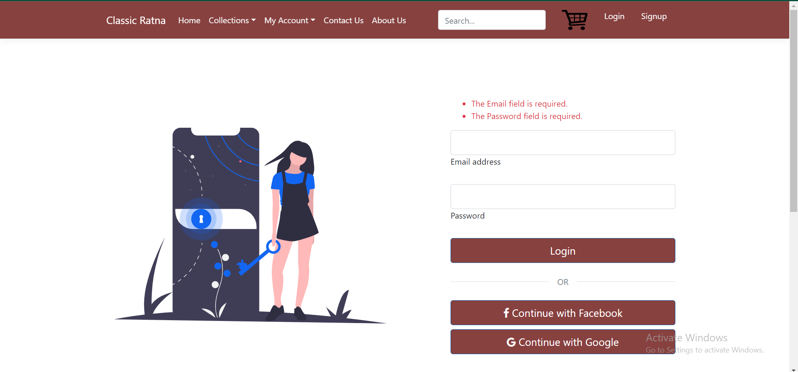
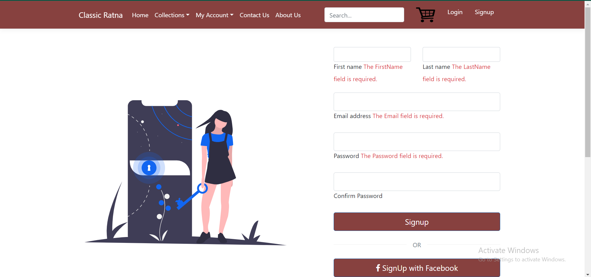

# 💍 Online Webmart for Jewellery

An e-commerce platform developed to simplify and digitize the jewellery shopping experience. Built using **ASP.NET Core MVC**, **Bootstrap-5**, and **SQL Server**, this project was developed during an internship at Cognizant Technology Solutions as part of a B.Tech. CSE curriculum.

---

## 📌 Project Overview

Jewellery shopping has evolved from traditional store visits to digital storefronts. This project bridges the gap between jewellery businesses and modern buyers through a user-friendly, responsive, and interactive web application that allows users to browse, purchase, and manage jewellery products online.

---

## 🧰 Tech Stack

| Component        | Technology Used                  |
|------------------|----------------------------------|
| Frontend         | ASP.NET Core MVC, Bootstrap 5    |
| Backend          | C# with ASP.NET Core 5.0         |
| Database         | SQL Server 2019 Express          |
| ORM              | Entity Framework Core            |
| IDE              | Visual Studio Code 2019          |
| Mail Service     | MailKit                          |
| Authentication   | ASP.NET Core Identity            |
| Version Control  | Git + GitHub                     |

---

## 🧩 Modules Implemented

### 1. Authentication/Authorization
- User registration with password validation
- Login/logout functionality
- Role-based access for users and admins

---

### 2. Home Page
- Fixed navigation bar
- Slider showcasing main collections
- Category cards for browsing

---

### 3. Collections Module
- Dropdown navigation to jewellery categories
- Product display with add-to-cart functionality
- 8 distinct product category pages

---

### 4. My Account - Future Scope of this project
- **Wishlist**: Save items for future purchases
- **Order History**: View and track order statuses
- **Returns**: Request returns with feedback

---

### 5. Contact Us Page
- Display store location using Google Maps
- Feedback submission via form using MailKit

---

### 6. About Us Page
- Team information with social media links

---

### 7. Cart System - Future Scope
- Add/remove/update items in cart
- Checkout flow with address and payment steps
- Order summary and redirection to order tracking

---

### 8. Content Management (Admin)
- CRUD operations for jewellery items and categories
- Admin controls using Repository Pattern and Unit of Work

#### Content Managenent

#### Item CRUD Operations

#### Product CRUD Operations

---

## 🔚 Conclusion

This project demonstrates the development of a basic web application using modern .NET technologies. It focuses on usability, responsiveness, and real-world e-commerce functionalities. It served as an excellent hands-on learning experience in the corporate software development cycle using Agile methodologies.

---
